# Raspberry Pi: Pi-hole Ad-Blocking + Unbound DNS + WireGuard VPN

This project is centered around getting a Raspberry Pi set up on a simple home network in order to block ads and naughty DNS requests, secure the DNS requests of all devices on the network, and provide a VPN solution for when any of these devices are outside of the network and would like to take advantage of the security (and speed) benefits of the network remotely.


There are several guides written about this or similar setups, but in practice, there was always something missing or assumptions were made about certain steps in the process. This guide is meant to shed some light on those steps, simplify the process of getting set up, and explain my findings in order to help anyone else trying to do the same.

This is what worked for me, your miles may vary.

## Buy Me a Coffee?

When I first started tinkering with my Raspberry Pi, I had no idea how much time I would invest in getting it up and running. I'm happy to share my findings with the community here for free, but if you'd like to say thanks, a free coffee (or beer) is always welcome.

[](https://ko-fi.com/K3K41NM18)

## Translations

Available in other languages: [French (coming soon)](README.fr.md)

## Prerequisites

While I won't have time to troubleshoot other setups, I'm sharing what I had to work with here. For this setup, I currently use:

- Raspberry Pi 3 Model B Plus Rev 1.3
- Raspbian 10 Buster Lite
- 16GB MicroSD card (4GB might be enough, but I'd stick with at least 8GB)
- Mac running macOS Catalina (for prepping, backing up, and restoring the SD card)
- The free [ApplePi-Baker](https://www.tweaking4all.com/hardware/raspberry-pi/applepi-baker-v2/) app for macOS
- USB SD card reader (I use this simple [Anker 2-in-1 card reader](https://amzn.to/2OaNBd1))
- Keyboard (and optional mouse) for initial Raspberry Pi setup (I used my wife's [Apple Magic Keyboard connected via a USB Lightning cable](https://www.reddit.com/r/mac/comments/6m3rpm/question_possible_to_use_magic_keyboard_2_without/))
- HDMI cable and monitor for initial Raspberry Pi setup (I hooked mine to a TV)
- Apple Time Capsule router (connected directly to a cable modem, acting as a DHCP server)

**Note**: I originally used a cheap wireless mouse that has its own USB Bluetooth dongle, but had errors when booting my Raspberry Pi with it attached. After some research, it seems this may conflict with the Pi's onboard Bluetooth chip, and it was causing issues (dhcpcd was throwing errors as well). During my most recent install from scratch, I removed it completely and everything went smoothly. I don't think you really need a mouse at all if you're running Raspbian Lite anyway...

That said, this process should work on any Raspberry Pi 2 v1.2 and above, and there are Windows/Linux tools to handle the SD card management.

## Installing Raspbian on the Raspberry Pi

There are many operating systems available to run on the Raspberry Pi, but we'll be using the latest version of Raspbian for this tutorial. There are also several different ways to install Raspbian on your Raspberry Pi, including the official [Raspberry Pi Imager](https://www.raspberrypi.org/documentation/installation/installing-images) and N00BS (New Out Of the Box Software), an easy operating system installer that allows you to erase your Raspberry Pi's SD card and start from scratch quickly, which is great when you're experimenting with your new device.

**Note:** After a power outage, my Raspberry Pi wouldn't boot properly so I tried formatting and restoring the SD card to no avail. I also couldn't get my Pi to boot with a fresh copy of N00BS for some reason, so I switched to using the Raspberry Pi Imager, which worked perfectly.

### Installing Raspbian with Raspberry Pi Imager

This is the simplest way to get Raspbian installed on your Raspberry Pi. [Official installation instructions](https://www.raspberrypi.org/documentation/installation/installing-images/README.md) are available from the Raspberry Pi website.

#### Step 1: Download Raspberry Pi Imager

From the [official Raspberry Pi Downloads page](https://www.raspberrypi.org/downloads/), download Raspberry Pi Imager for your OS (Windows, macOS, and Ubuntu apps are available).

#### Step 2: Write the Image to Your SD Card

Next, open the Raspberry Pi Imager app and insert the microSD card into your computer. then choose an operating system to install. We'll stick with Raspbian Lite for a headless Raspberry Pi in this case (you'll want the 64-bit version if you're using a Raspberry Pi 3, 4, or 400). Then choose your microSD card from the second button's modal, at which point the **WRITE** button will be available.

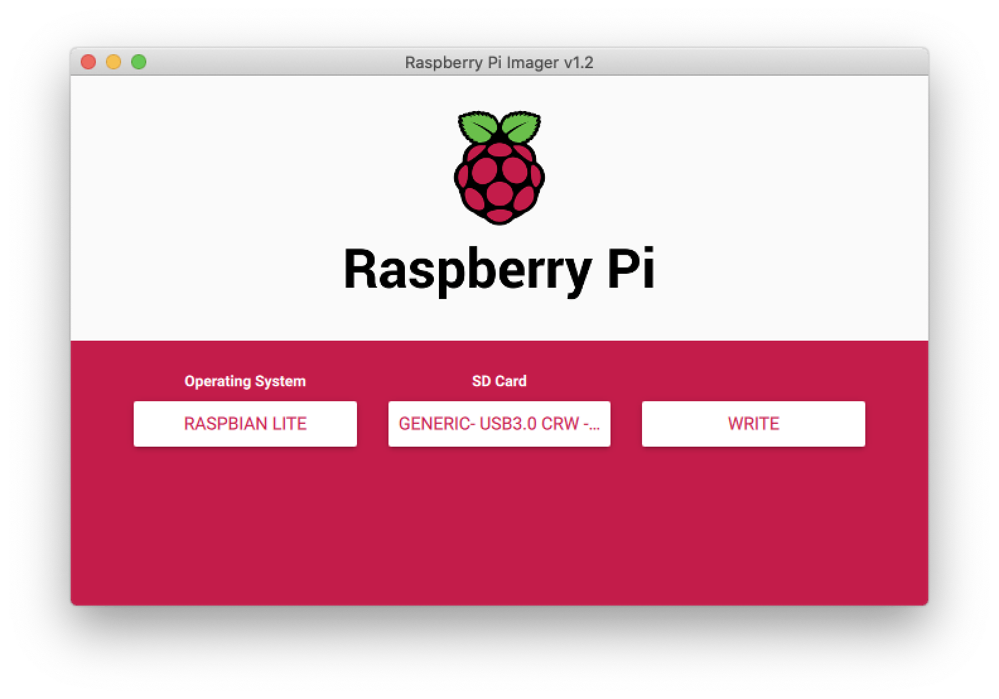

Before writing the OS to the microSD card, click the gear icon in the bottom right of the window to include advanced settings for your OS. You'll first be prompted:

`Would you like to prefill the wifi password from the system keychain?`

I declined this option as I'll be adding this Raspberry Pi to a wired network. Next, check out the Advanced Options. From here you can enable SSH, set a username and password, configure the wireless LAN, and add locale settings. This will speed up your OS setup time, but all of these options can be done from the Raspberry Pi Configuration Tool later as well.


Save these options (either for this session only, or to always use) and then click the **WRITE**. The process takes just a few minutes to move the files, and maybe a minute or two more to verify them. And that's it! Remove the SD card from your computer when prompted, and insert it into your Raspberry Pi before booting it up to a fresh install of Raspbian.

### Installing Raspbian with N00BS

To get started, follow the instructions below, or refer to the [N00BS Installation Guide](https://www.raspberrypi.org/documentation/installation/noobs.md).

#### Step 1: Download N00BS

You can [download N00BS](https://www.raspberrypi.org/downloads/noobs/) for free in either the full version (includes Raspbian and LibreELEC installation files) or the Lite version (nothing is pre-loaded, you'll download installation files from the internet during the setup of your Raspberry Pi). The difference here is that the Lite version takes much less time to load onto your SD card but then requires more time during setup on your Raspberry Pi to download all the files.

**Note:** The full version is around 2.5GB of files that will take around 20-30 minutes to transfer to the SD card, at least with my configuration.


#### Step 2: Format the SD Card

If you're on a Mac, do yourself a favor and download the free utility [ApplePi-Baker](https://www.tweaking4all.com/hardware/raspberry-pi/applepi-baker-v2/). You can use it to create backups of your Raspberry Pi's SD card, restore from backups, and much more. For now, though, we'll use it to quickly prep our SD card for N00BS installation.

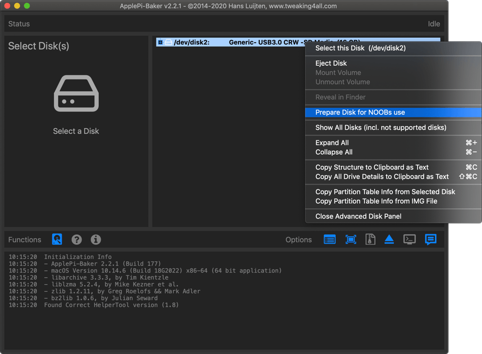

Select the disk utilities (small hard drive icon) in ApplePi-Baker and then right-click on your SD card. One of the menu options is **Prepare Disk for N00Bs use**. Run that and you should have a properly formatted SD card that's ready for your N00BS files.

If you aren't on a Mac, or can't use ApplePi-Baker, you can format your SD card using the [SD Association's Formatting Tool](https://www.sdcard.org/downloads/formatter/), available for Windows and macOS. For Linux folks, try [gparted](https://gparted.org/).

**Note**: After formatting the SD card, I recommend safely ejecting it, removing it from your card reader, and then reinserting it before attempting to copy the N00BS files to it. Without doing this, I sometimes end up with I/O errors when booting from my Raspberry Pi (similar to the [forum thread here](https://www.raspberrypi.org/forums/viewtopic.php?p=459823)). For more on installing Rasbian images, see the [Raspberry Pi documentation](https://www.raspberrypi.org/documentation/installation/installing-images/mac.md).

#### Step 3: Copy Files from N00BS Folder to SD Card

Once your downloaded N00BS archive is downloaded and uncompressed, copy all the files and folders inside your N00BS folder to the root of the SD card. You can also refer to the `INSTRUCTIONS-README.txt` file included with N00BS for more.

On a Mac, I used the Terminal to do this via the command line, though you should be able to drag and drop using Finder. To do this via the CLI, first change to the directory where your uncompressed N00BS files are located:

```shell
cd ~/Downloads/NOOBS_v3_3_1
```

Or wherever your N00BS folder was created. Then copy all files and directories for N00BS to the SD card:

```shell
cp -R ./ /Volumes/RASPBERRY
```

Where `RASPBERRY` is the name of the SD card (this is the default for ApplePi-Baker's **Prepare Disk for N00BS use** option).

#### Booting N00BS and Installing Raspbian

Once the SD card is ready, safely eject it from your computer and insert it into your Raspberry Pi, then boot your Pi. If you need help, follow [these simple instructions](https://projects.raspberrypi.org/en/projects/raspberry-pi-setting-up/3) to get started with your Raspberry Pi. You'll be taken to the N00BS installer screen where you can choose to install any one of several operating systems, including Raspbian. You can choose from Lite (console only), Desktop (includes a GUI), or Full (Desktop and recommended applications).


For this setup, we'll install Raspbian Lite (console only). If you ever want to add the desktop GUI, you can [always add that later](https://gist.github.com/kmpm/8e535a12a45a32f6d36cf26c7c6cef51).

Installation took just 7 minutes (with the full N00BS files, installing Raspbian Lite, over ethernet), but depends on many factors including whether you chose Lite or the normal N00BS files and how fast your internet connection is. Once installed, your Raspberry Pi will reboot into the console of a fresh install of Raspbian.

## Initial Setup of Raspbian

To login to your freshly baked Raspberry Pi, use the default username/password pair of `pi` and `raspberry` (yes, very original). We'll change the password soon enough, but the next steps allow us to use our Pi in a headless state without having to rely on an external display or keyboard attached.

### Prepping Raspbian for SSH

We should enable SSH on the Raspberry Pi so that we can SSH into it from any device on the network, thus no longer needing the mouse, keyboard, HDMI cable, and screen. You'll need to know the IP address of your Raspberry Pi to continue.

#### Setting Up a Static IP Address

First, we need the IP address and MAC address of the Raspberry Pi. It's highly recommended that you set up a static IP address on your network for your Raspberry Pi so that you can easily SSH into it, and later, point other services directly to it.

To get the current IP address of your Raspberry Pi, run:

```shell
ifconfig
```

And you'll see some output that should include both `eth0` details and `wlan0` details. The former is your ethernet (wired) network interface, while the latter is your wireless (wifi) network interface. Depending on how you'll be connecting your Raspberry Pi to your network, you'll need to focus on one or the other.

If your Raspberry Pi is wired into your network via an ethernet cable, take a look at the `eth0` interface and find the following line:

```text
inet 192.168.x.x netmask 255.255.255.0 broadcast 192.168.x.255
```

Where `192.168.x.x` is the IP address of the Raspberry Pi (I've obfuscated this for privacy reasons). If you see a line that starts with `inet6`, then your device is configured to use IPv6 as well:

```text
inet6 feXX::XXXX:XXX:XXXX:XXXX prefixlen 64 scopeid 0x20<link>
```

The Raspberry Pi's MAC address is just below the `inet` line(s):

```text
ether ab:cd:ef:12:34:gh txqueuelen 1000 (Ethernet)
```

Where `ab:cd:ef:12:34:gh` would be the unique MAC address of the `eth0` interface on this Raspberry Pi. In order to force your network's router to give the Raspberry Pi a static IP address (the same IP every time it connects), you'll need to modify the `/etc/dhcpcd.conf` file on the Raspberry Pi directly, or edit the settings of your router and add a DHCP Reservation (as I have below):

```text
Description: Raspberry Pi
Reserve Address By: MAC Address
MAC Address: ab:cd:ef:12:34:gh
IPv4 Address: 192.168.x.x
```

Once you've created a static IP address of your choosing (matching your router's existing subnet schema), save your changes and restart your router.

#### Enabling SSH on the Raspberry Pi

Now we'll open the Raspberry Pi's Configuration Tool:

```shell
sudo raspi-config
```

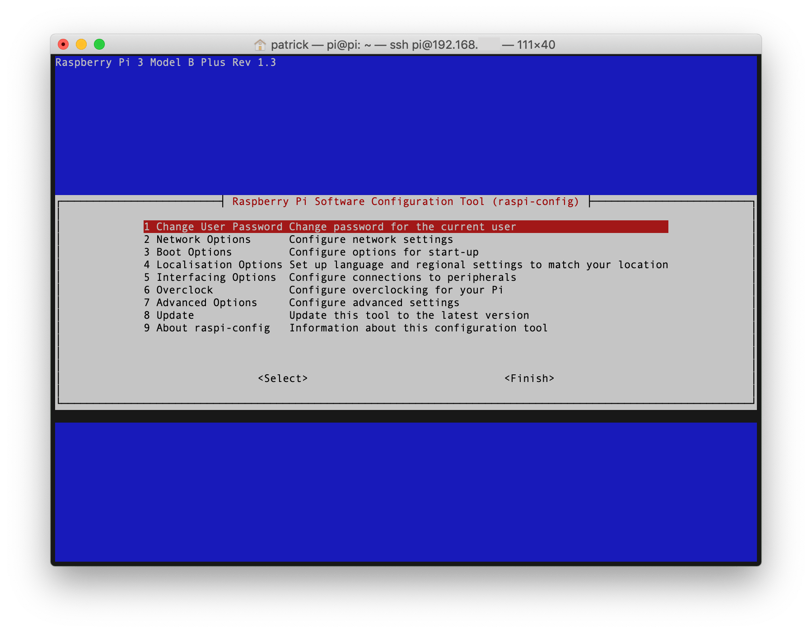
Under the **Interfacing Options** group, go to **SSH** and enable it.
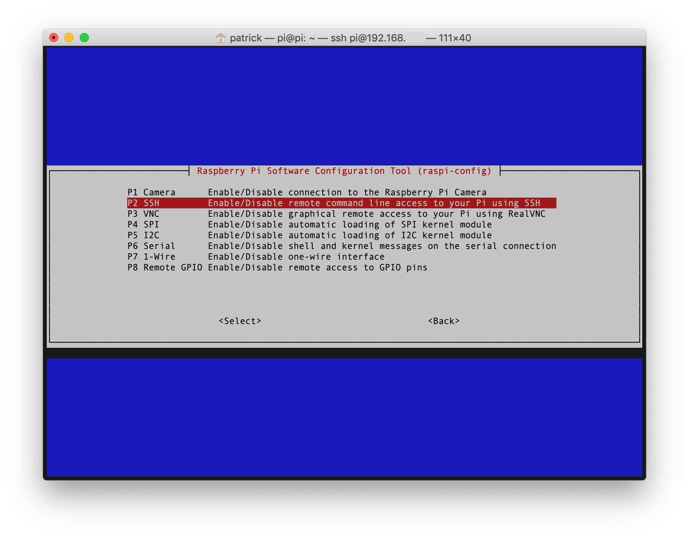
You should be prompted to restart your Raspberry Pi. If you aren't, exit the Configuration Tool and type:

```shell
sudo reboot
```

**Note**: On reboot, if you notice any failures and end up in "Emergency Mode", make sure you've disconnected any Bluetooth USB modules (like the one I use for a Bluetooth mouse during installation). There seems to be [an issue around these modules](https://www.raspberrypi.org/forums/viewtopic.php?f=28&t=208966) which causes errors during bootup. After login, under "Emergency Mode", type `systemctl default` or `exit` to reboot into "Default Mode."

##### Verify You Can SSH into the Raspberry Pi

Now that you've enabled SSH on the Raspberry Pi and given it a static IP address, you should be able to do all of the following setup from another device by connecting via SSH.

On your system's console (I'm using the Terminal app for macOS) type:

```shell
ssh pi@192.168.x.x
```

Where `pi` is the username on your Raspberry Pi and `192.168.x.x` is the static IP address you just set up. If your system supports [mDNS](https://en.wikipedia.org/wiki/Multicast_DNS) (Macs do by default), you should be able to use `raspberrypi.local` [in place of your IP address](https://www.raspberrypi.org/documentation/remote-access/ip-address.md):

```shell
ssh pi@raspberrypi.local
```

Then type the default password of `raspberry` to login. You should now be greeted with the Raspbian console.

**Note**: If you get an error that says the host identification has changed, you’ll need to remove the old entry (the one with the same static IP address) from your `hosts` file first (on a Mac, that file is `~/.ssh/known_hosts`), then try again.

##### Change Your Password

Using default passwords is obviously not a great idea, so your first task after you SSH into your newly setup Raspberry Pi is to change the password using:

```shell
passwd
```

Enter your current password (`raspberry`) and then type and retype a new password.

**Optional: Change pi Username**

If you'd rather not stick with the default username of `pi`, changing your Raspbian username is unfortunately not as easy as you'd think. Because you're currently logged in as `pi` and you can't change the username of the current user, you have to get creative with how you go about this. You could create a new user, logout of the `pi` user, login as the new user, and then as root you can change the username of `pi` and its home directory. But now you have a second user.

You can also follow along with [these instructions on adding a temporary user and using it to change pi's username](https://askubuntu.com/a/34075), but I can't vouch for this method as I skipped it altogether.

##### Password-less SSH Access

It's possible to [configure the Raspberry Pi to allow a computer to access it without providing a password each time](https://www.raspberrypi.org/documentation/remote-access/ssh/passwordless.md) you try to connect. In your Mac's Terminal app, [generate SSH key pairs](https://www.ssh.com/ssh/keygen/) with:

```shell
ssh-keygen -t rsa -b 4096
```

and enter a password for the SSH key (store this somewhere secure, you may need it at a later time). If you already have SSH key(s), give this pair a different name (such as `id_rsa_pi`) or use your existing key. Now that the public and private keys have been generated on your Mac, you'll need to copy the public key to your Raspberry Pi using:

```shell
ssh-copy-id pi@192.168.x.x
```

where `pi` is the username you use on the Raspberry Pi and the `192.168.x.x` is the static IP address of the Raspberry Pi. You'll need to enter the password for the `pi` user to confirm the copy. From now on, you won't have to enter a password to SSH into your Raspberry Pi.

##### Keep Client SSH Keys in macOS Keychain

Using [an SSH agent](https://www.ssh.com/ssh/agent/), you can store your SSH key(s) in your Mac's Keychain for easy (and secure) access. Add your newly created SSH key pair to the macOS Keychain with:

```shell
ssh-add -K ~/.ssh/id_rsa_pi
```

where `id_rsa_pi` is the name you used to create the SSH key pair. Enter your macOS password to confirm. In order to prevent macOS from forgetting your SSH keys on restart, you can add it to your `~/.ssh/config` file based on [these instructions](https://apple.stackexchange.com/a/250572). Your `~/.ssh/config` file should look something like this:

```
Host *
    UseKeychain yes
    AddKeysToAgent yes
    IdentityFile ~/.ssh/id_rsa
    IdentityFile ~/.ssh/id_rsa_pi
```

Now once again, SSH into your Raspberry Pi using the Terminal application by typing `ssh pi@192.168.x.x` where `192.168.x.x` is the static IP address of your Raspberry Pi, and you shouldn’t have to enter a password again from this device! Repeat these steps on other devices to generate and share their SSH key(s) with the Raspberry Pi.

### Optional: Additional Raspbian Configuration

Here are some additional steps I prefer to take upon setting up my Raspberry Pi. First, open the Configuration Tool via your SSH session:

```shell
sudo raspi-config
```

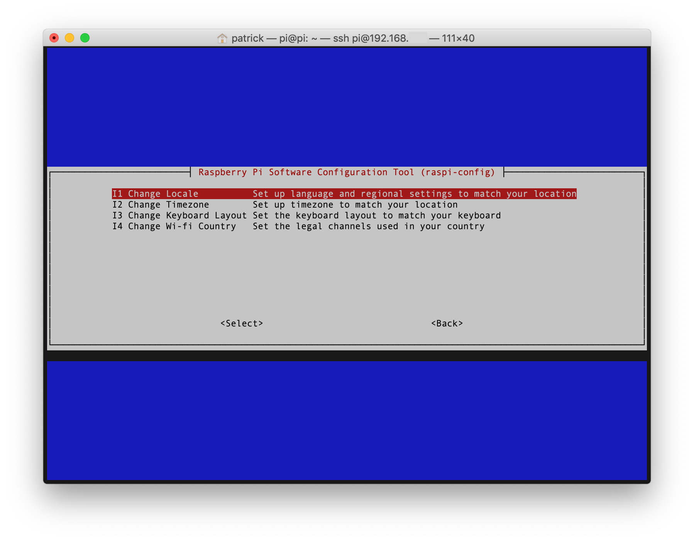

- Under **Network Options**, change the **Hostname** to something other than `raspberrypi` (most of the devices on my network are [named after Transformers](https://tfwiki.net/wiki/The_Transformers_(toyline))).
- Under **Localisation Options**, go to the **Change Locale** options and add `en-us.UTF-8` (or whatever your locale is) to your selected locales, then select it as the default locale (*do not* remove the default `en-gb.UTF-8` as it seems to cause issues)
- Under **Localisation Options**, change the timezone to match yours

### Update Raspbian and Packages

Once you've got everything up and running, you'll want to [update all the Raspbian packages and upgrade any that need it](https://www.raspberrypi.org/documentation/raspbian/updating.md) using [APT (Advanced Packaging Tool)](https://wiki.debian.org/Apt) by running:

```shell
sudo apt update
```

to update packages and then:

```shell
sudo apt-get upgrade -y
```

to upgrade any packages you have installed to their latest versions. This may take a while, so you may want to go grab a coffee, beer, tea...

**Note**: If at any point during an `apt update` your package cache file is corrupted, remove your apt lists and refresh them using:

```shell
sudo rm -r /var/lib/apt/lists/
sudo mkdir -p /var/lib/apt/lists/partial
sudo apt-get update
```

## Backup and Restore a Raspberry Pi

Throughout the process of setting things up, you may want to have a backup of your Raspberry Pi so you don’t have to start from scratch if you make a mistake like I have (several times). You may even want to clone your Raspberry Pi after each successful step so you can return to it if the next step goes wrong. For instance, I was sure to create a backup of my Raspberry Pi after initial setup, after I had Pi-hole working, after I added Unbound, and after I got WireGuard setup. That way if I made any changes that broke my setup, I could always revert the previous working installation.

### Backup the Raspberry Pi SD Card

There are many ways to do this, but if you're on a Mac the aforementioned [ApplePi-Baker](https://www.tweaking4all.com/hardware/raspberry-pi/applepi-baker-v2/) app is fantastic and handles backing up your Raspberry Pi's SD card, not to mention restoring from several different formats as well.
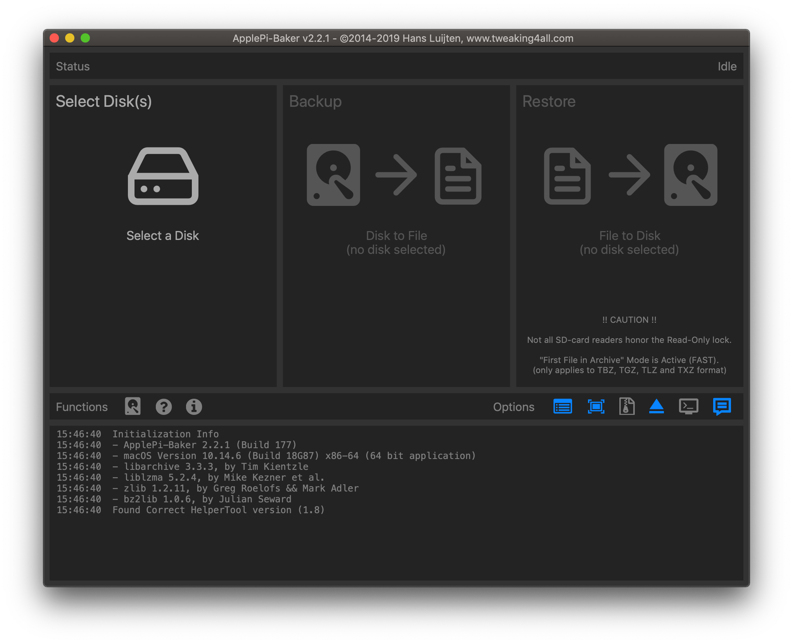
At any point you want to backup your Raspberry Pi's configuration, first shut down the device with:

```shell
sudo halt
```

or the more verbose:

```shell
sudo shutdown -h now
```

and then unplug your Raspberry Pi (or get a [Pi Switch](https://amzn.to/2s7axRP) to make life easier). Remove the SD card from the Raspberry Pi and insert it into a supported SD card reader (like the [Anker 2-in-1 card reader](https://amzn.to/2OaNBd1) I mentioned earlier), and connect to your Mac.

When you open the ApplePi-Baker app, you should be able to select the SD card from the **Select a Disk** options (make sure you select the right disk), then choose the **Backup** option. In the file choose window, select **IMG** from the Format selections at the bottom of the window, and then give the backup file a name. This should take some time, be prepared to wait.

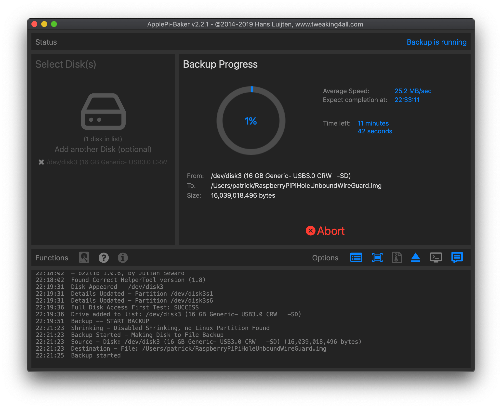

**Note**: The IMG format allows ApplePi-Baker to shrink the Linux partition on backup and expand it on restore, saving you from having to backup the entire size of the SD card rather than just the actual contents.

#### Using the macOS Terminal

Another way to backup your SD card on a Mac is to open Terminal and type:

```shell
diskutil list
```

to see a list of drives attached to your Mac. To create a Disk Image of the SD card:

```shell
sudo dd if=/dev/rdisk2 of=~/RaspberryPiBackup.dmg
```

where `/dev/rdisk2` is the path to your SD card’s disk (with an added `r`) and `~/RaspberryPiBackup.dmg` is the path and filename on your Mac to save the Disk Image. Enter your Mac user’s password when prompted. This may take a while depending on the size of your SD card and what you have installed on it.

**Note**: If you see any input/output errors, try using Disk Utility instead.

#### Using the macOS Disk Utility

Open the macOS Disk Utility application, and choose View > Show All Devices. Right click on the device name of the SD card (not the individual partition(s)!) and choose the **Image from ‘DEVICE NAME’** option. Give the file a name and choose a location to save it. Choose the DVD/CD master option for Format, and no Encryption. Disk Utility will create a .CDR file with your SD card’s files.

**Note**: Both the Disk Utility and Terminal methods failed for me, both creating input/output errors. Maybe it was my SD card or my card reader, but then using ApplePi-Baker gave me no issues, so I didn't bother to investigate further.

### Restoring a Raspberry Pi from Backup

If you’ve made a backup of your Raspberry Pi’s SD card previously, you can restore it any time and overwrite your current configuration. Using the ApplePi-Baker app on macOS, this is a simple task.

First, shut down your Raspberry Pi:

```shell
sudo halt
```

and remove the SD card from your Raspberry Pi. Using a supported SD card reader, insert the SD card from your Raspberry Pi into your Mac. Launch the ApplePi-Baker app and select the correct SD card disk, then choose the **Restore** option. ApplePi-Baker will expand the backup file and overwrite the complete contents of your SD card with the backup file's contents, so make sure you really want to do this.

#### Using the macOS Terminal to Restore

You can also use the macOS Terminal application to this by typing:

```shell
diskutil list
```

to see a list of drives attached to your Mac. You'll need to unmount the SD card to proceed (your Mac can still see the files, but you won't see the mounted disk(s) anymore):

```shell
diskutil unmountDisk /dev/disk2
```

where `/dev/disk2` is the path to your SD card’s disk. Restore the SD card from backup using:

```shell
sudo dd if=~/RaspberryPiBackup.dmg of=/dev/disk2
```

where `/dev/disk2` is the path to your SD card’s disk and `~/RaspberryPiBackup.dmg` is the path and filename on your Mac to save the Disk Image. This may take a while depending on the size of your SD card backup

**Note**: If you backed up the SD card as a .CDR, you can rename it to .ISO and restore it to any SD card with the free [Etcher application](https://www.balena.io/etcher/) for macOS.

## Setting Up Pi-hole

[Pi-hole](https://pi-hole.net/) provides ad-blocking at the network level, meaning you not only stop ads from making it to any of the devices on your network, but you also block the unnecessary network requests for those ads and thus reduce bandwidth usage. Pi-hole pairs nicely with a VPN (Virtual Private Network) so that you can connect remotely and still take advantage of ad-blocking from anywhere outside your network.


First, you'll need to run the Pi-hole installer:

```shell
sudo curl -sSL https://install.pi-hole.net | bash
```

**Note**: If you see the error “Script called with non-root privileges” during setup, you can download the install script and run it as root instead. Do this by downloading the script:

```shell
wget -O basic-install.sh https://install.pi-hole.net
```

and then run the installer as root:

```shell
sudo bash basic-install.sh
```

During setup, select **OK** for the first few screens, then select either `eth0` for ethernet (wired) or `wlan0` for wireless (wifi) on the **Choose An Interface** screen. Next, select any **Upstream DNS Provider** since we’ll be using our own Unbound server later. Choose any **Block Lists** you want to use, or leave them all checked by default. Choose both IPv4 and IPv6 on the **Select Protocols** screen. Use the current network settings on the next screen, assuming you gave your Raspberry Pi a static IP address earlier. Then decide if you want to install the Web Interface for Pi-hole (and `lighthttpd` to serve it), which you'll typically want to keep an eye on your traffic and blocked queries (and to make additional configuration changes) in a web browser.

Lastly, decide how you want to log queries and what [privacy level](https://docs.pi-hole.net/ftldns/privacylevels/) you want for FTL (Faster Than Light). Setup will finish, and the Pi-hole DNS service will be running.

### Using Pi-hole’s Web Interface

After Pi-hole’s setup is complete, you should see the default Web Interface password on the console. You can change the  password using:

```shell
pihole -a -p
```

Now you can access the Pi-hole Web Interface in your browser by going to `http://raspberrypi.local/admin` (if your device supports mDNS) or `http://192.168.x.x/admin`, where `192.168.x.x` is the static IP of your Raspberry Pi (you can also use <http://pi.hole/admin> once you point your router to use Pi-hole as your DNS service in the next step). Go to Login, then enter the new password you set for the Web Interface and check the “Remember me for 7 days” checkbox before logging in. You won’t see much on the Dashboard yet since nothing on your network is using Pi-hole, but that should change momentarily.


### Use Pi-hole as Your DNS Server

To make sure Pi-hole is working, you can set a single device to use it as its DNS service or you can point your network’s router to it instead to force (almost) every device on your network to use Pi-hole as its DNS service. Most routers have a setting for Primary and Secondary DNS, and you'll want to point the Primary DNS Server to the static IP address of your Raspberry Pi (`192.168.x.x`) and the Secondary DNS Server to a 3rd party DNS service like Google (8.8.8.8) or Cloudflare (1.1.1.1) in case your Pi-hole server goes down for some reason and you don’t want to lose all connectivity to the outside world (like when you're fiddling around with your Raspberry Pi in the upcoming steps).

Restart your router and watch as the Pi-hole Dashboard (now available on your internal network at <http://pi.hole/admin>) fills up with blocked queries!

**Note**: If at any point your Raspberry Pi loses its connection with the outside world and you want to set a temporary DNS server to resolve it, run:

```shell
echo "nameserver 8.8.8.8" | sudo tee /etc/resolv.conf > /dev/null
```

to temporarily set the device's DNS server to Google until you can figure out what you did. This will reset on reboot.

## Setup Unbound as Your DNS Service

> [Unbound](https://www.nlnetlabs.nl/projects/unbound/about/) is a validating, recursive, caching DNS resolver. It is designed to be fast and lean and incorporates modern features based on open standards.

Setting up Unbound DNS with your Pi-hole installation allows us to [operate our own tiny, recursive DNS server](https://docs.pi-hole.net/guides/unbound/) instead of relying on (and sending data to) the big players like Google or Cloudflare.

To install Unbound on the Raspberry Pi:

```shell
sudo apt install unbound
```

**Note**: If you've installed Pi-hole first and then Unbound as I have here, you might see some errors during installation of the latter, specifically `Job for unbound.service failed because the control process exited with error code.` After [some research](https://www.reddit.com/r/pihole/comments/faf0y6/unbound_fails_to_install_with_pihole/), I decided to continue on with [the Pi-hole guide to setting up Unbound](https://docs.pi-hole.net/guides/unbound/#setting-up-pi-hole-as-a-recursive-dns-server-solution), which seemed to work fine. I'm not sure what causes the errors, but I've decided not to investigate further at this time.

Afterwards we'll need to download a `root.hints` file to replace the built-in hints:

```shell
wget -O root.hints https://www.internic.net/domain/named.root
```

Then move the `root.hints` file to the Unbound configuration directory:

```shell
sudo mv root.hints /var/lib/unbound/
```

### Configure Unbound DNS

Unbound includes a lot of different configuration options that you can adjust and try out. Feel free to scan the [Unbound configuration file documentation](https://www.nlnetlabs.nl/documentation/unbound/unbound.conf/) for details about each option.

To get started, edit the Unbound configuration file for Pi-hole:

```shell
sudo nano /etc/unbound/unbound.conf.d/pi-hole.conf
```

and remove the contents of the file (there is likely nothing there yet) before copying and pasting the contents of the [sample pi-hole.conf](pi-hole.conf) configuration file in this repository. When you're done, exit and save the file.

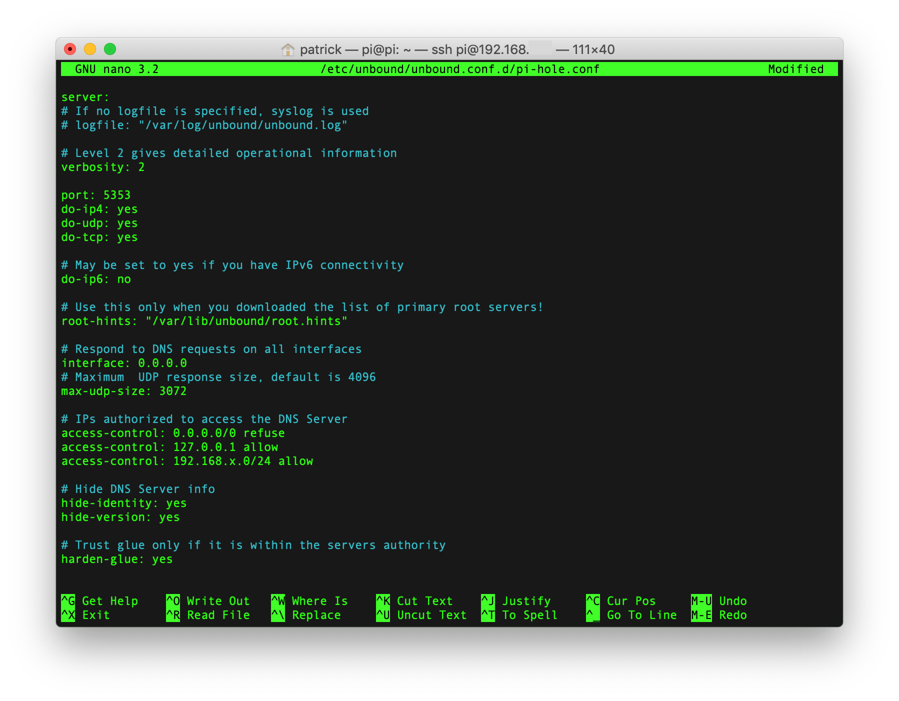

#### Configuration Details

The default port for Unbound is `53` but we're changing it to `5353` here. Feel free to change it to whatever you like, but you'll need to remember it later when we tell Pi-hole where to send upstream DNS requests:

```
port: 5353
```

This points to the `root.hints` file you just downloaded:

```
# Use this only when you downloaded the list of primary root servers!
root-hints: "/var/lib/unbound/root.hints"
```

Here we're refusing connections to all interfaces and then we're allowing anything from this device (your Raspberry Pi) and anything from our local subnet (be sure to change `192.168.x.0` to whatever your local subnet is):

```
# IPs authorized to access the DNS Server
access-control: 0.0.0.0/0 refuse
access-control: 127.0.0.1 allow
access-control: 192.168.x.0/24 allow
```

If your router creates a "Guest Network" with a separate SSID and DHCP range like mine (Apple Time Capsule), devices connecting to that wireless network will not be able to connect to the internet unless you grant access to that subnet. Uncomment one of the lines below or add your own based on your guest network's DHCP range:

```
# If you have a guest network with a separate DHCP range
#access-control: 172.16.1.0/24 allow
#access-control: 10.0.0.0/24 allow
```

**Note**: Devices connected to an AirPort guest network [will not be able to use Pi-hole](https://www.reddit.com/r/pihole/comments/fjpif9/pihole_doesnt_work_on_guest_network/) since your Raspberry Pi is on a separate DHCP range. They also will not have access to a DNS resolver, so they won't be able to connect to much of anything unless each device is set to manually connect to an outside DNS server, such as `1.1.1.1`. I have yet to figure out whether it's possible to get around this.

You can adjust the cache settings if you like. Instead of the default of not caching, here we set the minimum TTL (Time To Live) to 1 hour, afterwards the DNS will do another lookup of the cached data:

```
# Time To Live (in seconds) for DNS cache. Set cache-min-ttl to 0 remove caching (default).
# Max cache default is 86400 (1 day).
cache-min-ttl: 3600
cache-max-ttl: 86400
```

When Pi-hole was doing DNS, it created this custom record for <http://pi.hole> so we could easily reach the Web Interface without typing in the static IP address of the Raspberry Pi. Now that Unbound is our DNS, we'll need to create this custom record in the Unbound configuration file. Be sure to replace `192.168.x.x` with the static IP address of your Raspberry Pi:

```
# Create DNS record for Pi-hole Web Interface
private-domain: "pi.hole"
local-zone: "pi.hole" static
local-data: "pi.hole IN A 192.168.x.x"
```

Once the configuration file is saved, start the Unbound DNS server:

```shell
sudo service unbound start
```

And test to make sure the Unbound DNS is running (be sure to use the port you set above):

```shell
dig pi-hole.net @127.0.0.1 -p 5353
```

Which should return some information, including a `QUESTION SECTION` and an `ANSWER SECTION` that includes `pi-hole.net` and an IP address.

#### Testing DNSSEC Validation

Run the following command:

```shell
dig sigfail.verteiltesysteme.net @127.0.0.1 -p 5353
```

Which should return a status of SERVFAIL and no `ANSWER SECTION`:

```
;; ->>HEADER<<- opcode: QUERY, status: SERVFAIL, id: xxxxx
```

And then run this command:

```shell
dig sigok.verteiltesysteme.net @127.0.0.1 -p 5353
```

Which should return a status of NOERROR and an `ANSWER SECTION`:

```
;; ->>HEADER<<- opcode: QUERY, status: NOERROR, id: xxxx
```

### Allow Pi-hole to Use Unbound DNS

Now that your Unbound recursive DNS resolver is running locally, we'll force Pi-hole to use it for DNS rather than an outside source like Google (8.8.8.8) or Cloudflare (1.1.1.1) and keep all of our network traffic contained. Any traffic on your network will be sent to Pi-hole, which in turn will use Unbound for DNS resolution before blocking the appropriate domains and returning data.

First, open the Pi-hole Web Interface in a web browser on your local network: <http://pi.hole/admin>

Then go to **Settings > DNS** and uncheck any third party Upstream DNS Servers you had selected during setup. To the Custom 1 (IPv4) Upstream DNS Servers input, add:

```
127.0.0.1#5353
```

Where `127.0.0.1` points the Pi-hole server (the Raspberry Pi) to itself on port `5353`. If you changed the port in your Unbound configuration file, use that port here instead.

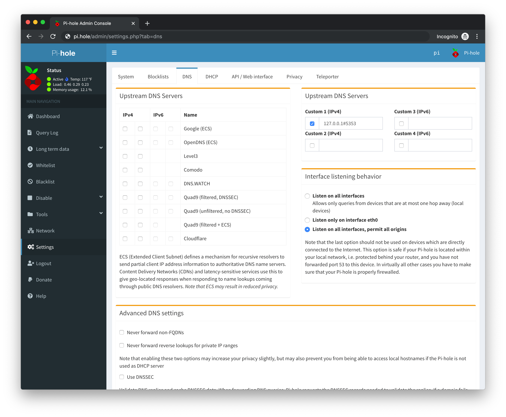

Next, uncheck **Never forward non-FQDNs** and **Never forward reverse lookups for private IP ranges** and check **Use Conditional Forwarding** and enter your router’s IP address (typically something like `x.x.x.1` on your subnet), along with the Domain Name (this can be set on your router, usually under the DHCP settings, to something like `home`).

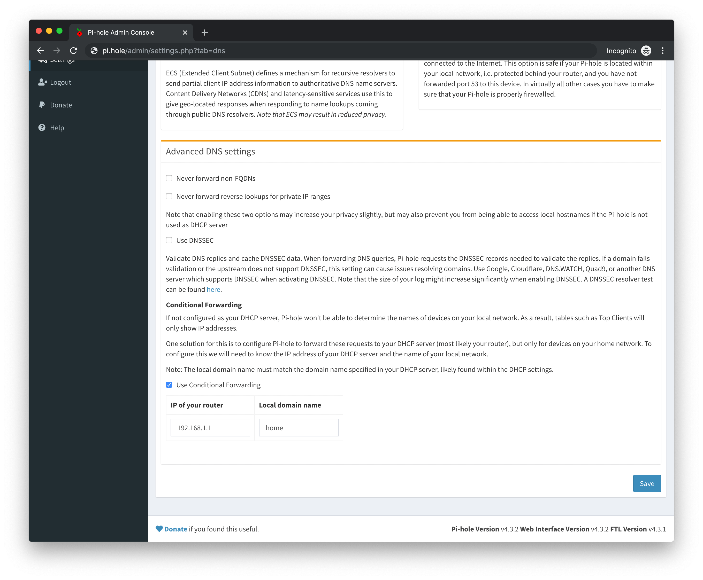

Lastly, *do not* check **Use DNSSEC** as Pi-hole is going to be using your Unbound DNS, which already enables DNSSEC (Domain Name System Security Extensions).

**When you're done, don't forget to save your settings.**

### Verify DNSSEC Signatures

To ensure that Unbound is configured correctly, visit this [DNSSEC Resolver Test](https://dnssec.vs.uni-due.de/) in a web browser using a device that's currently within your network and using your Raspberry Pi as a DNS server. Use the **Start test** button and this website will let you know whether or not Unbound is validating DNSSEC signatures.

## Setting Up a VPN with WireGuard

> [WireGuard](https://www.wireguard.com/) is an extremely simple yet fast and modern VPN that utilizes state-of-the-art cryptography. It aims to be faster, simpler, leaner, and more useful than IPSec while avoiding the massive headache. It intends to be considerably more performant than OpenVPN.

First, install the necessary packages before WireGuard setup begins:

```shell
sudo apt install raspberrypi-kernel-headers libelf-dev libmnl-dev build-essential git
```

Next, install the Debian distribution keys (otherwise your `apt update` will fail further down the line):

```shell
sudo apt-key adv --keyserver keyserver.ubuntu.com --recv-keys 7638D0442B90D010
sudo apt-key adv --keyserver keyserver.ubuntu.com --recv-keys 04EE7237B7D453EC
```

Switch to root with `sudo su` and enter the next 2 commands per the [Debian installation commands](https://www.wireguard.com/install/). since WireGuard is not included in the Raspbian distribution, we'll use the Debian one instead:

```shell
echo "deb http://deb.debian.org/debian/ unstable main" > /etc/apt/sources.list.d/unstable.list
```

Then we'll prevent our Raspberry Pi from using the Debian distribution for normal Raspbian packages:

```shell
printf 'Package: *\nPin: release a=unstable\nPin-Priority: 90\n' > /etc/apt/preferences.d/limit-unstable
```

Then `exit` root.

Update the package list:

```shell
sudo apt update
```

Then install `dirmngr` for handling certificates if it isn't already installed (use `which dirmngr` to check):

```shell
sudo apt install dirmngr
```

### Install WireGuard

Now you can install the WireGuard package:

```shell
sudo apt install wireguard
```

And to enable IP forwarding, you'll need to uncomment the `net.ipv4.ip_forward=1` line from your `/etc/sysctl.conf` file:

```shell
sudo nano /etc/sysctl.conf
```

Or you can type the following command to handle this for you:

```shell
sudo perl -pi -e 's/#{1,}?net.ipv4.ip_forward ?= ?(0|1)/net.ipv4.ip_forward = 1/g' /etc/sysctl.conf
```

Finally, reboot your Raspberry Pi:

```shell
sudo reboot
```

After reboot, verify that IP forwarding is enabled by running:

```shell
sysctl net.ipv4.ip_forward
```

You should see `net.ipv4.ip_forward = 1` as a result, otherwise add the above command to your `/etc/sysctl.conf` file.

### Generate Private & Public Keys for WireGuard

In the next steps, we'll need to create private and public keys for both the WireGuard server as well as a VPN client. Once everything is set up, we can create additional keys for other clients to use the VPN as well.

I've found it easiest to first become root before running the commands below:

```shell
sudo su
```

Then switch to the directory where we'll store the WireGuard keys:

```shell
cd /etc/wireguard
```

If this directory doesn't exist, just run `mkdir /etc/wireguard` and then `cd /etc/wireguard`. Set permissions on the entire directory with the [`umask` command](https://www.cyberciti.biz/tips/understanding-linux-unix-umask-value-usage.html) so that only the `root` user can read or write data here:

```shell
umask 077
```

Next, generate the server’s private & public keys in a single command:

```shell
wg genkey | tee server_privatekey | wg pubkey > server_publickey
```

Then generate a client’s private & public keys:

```shell
wg genkey | tee peer1_privatekey | wg pubkey > peer1_publickey
```

To confirm the keys were generated and have the correct file permissions:

```shell
ls -la
```

Finally, output your new WireGuard keys to the console and save them (somewhere safe, otherwise be sure and delete them when we're done here) for the next steps:

```shell
cat server_privatekey
cat server_publickey
cat peer1_privatekey
cat peer1_publickey
```

Lastly, `exit` root before continuing.

### Configure WireGuard Server

Create and edit the WireGuard configuration file:

```shell
sudo nano /etc/wireguard/wg0.conf
```

and replace the contents with the [WireGuard wg0.conf](wg0.conf) from this repository.

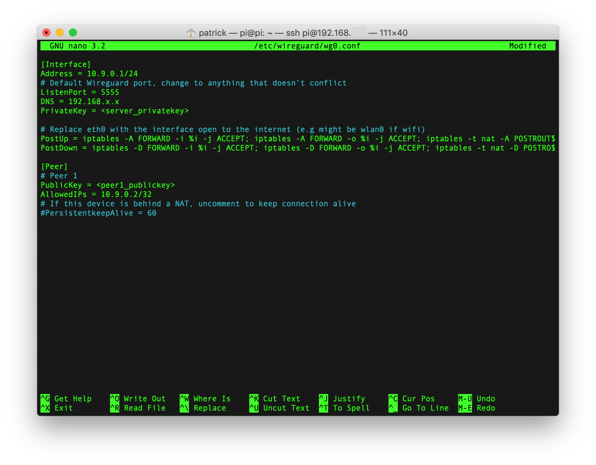

#### Configuration Details

This is the WireGuard interface, which will create a virtual subnet of `10.9.0.0` and assign itself an internal IP address of `10.9.0.1`. You can change this if you'd like, but you'll also need to change the internal IP of VPN clients as well.

```
[Interface]
Address = 10.9.0.1/24
```

The default port for WireGuard, which you can change if you'd like. You'll also need to open up this port on your router, otherwise incoming VPN traffic from outside your network *will not make it to WireGuard*. Information on how to do this is later in the guide.

```
# Default WireGuard port, change to anything that doesn’t conflict
ListenPort = 51820
```

**Note**: Some public wifi networks will block all ports other than `80` (TCP), `443` (TCP), and `53` (UDP) for HTTP, HTTPS, and DNS respectively. If you are connected to a public wifi network that does this, you will not be able to connect to your WireGuard VPN. One way around this is to set your WireGuard `ListenPort` to `53` and create a forward on your network's router on port `53`, thus circumventing the issue with blocked ports. Do this at your own risk, and definitely, **do not** enable Pi-hole's *Listen on all interfaces, permit all origins* DNS option if you are forwarding port `53` on your router.

Replace `192.168.x.x` with the static IP address of your Raspberry Pi:

```
DNS = 192.168.x.x
```

Replace `<server_privatekey>` with the output of your `cat server_privatekey` command earlier:

```
PrivateKey = <server_privatekey>
```

We're using `eth0` here when the Raspberry Pi is connected over ethernet (wired), but you can replace both instances with `wlan0` if your Raspberry Pi is connected via wifi (wireless):

```
PostUp = iptables -A FORWARD -i %i -j ACCEPT; iptables -A FORWARD -o %i -j ACCEPT; iptables -t nat -A POSTROUTING -o eth0 -j MASQUERADE
PostDown = iptables -D FORWARD -i %i -j ACCEPT; iptables -D FORWARD -o %i -j ACCEPT; iptables -t nat -D POSTROUTING -o eth0 -j MASQUERADE
```

##### Setup WireGuard Client Connections

The next section of the WireGuard configuration file is for clients that connect to the VPN. For each client (device), you'll need to add another `[Peer]` section here and also create a separate client configuration file (details for that are next).

Replace `<peer1_publickey>` with the output of your `cat peer1_publickey` command earlier:

```
[Peer]
# Peer 1
PublicKey = <peer1_publickey>
```

Using the virtual subnet created by WireGuard, give this device an internal IP address of `10.9.0.2`:

```
AllowedIPs = 10.9.0.2/32
```

Once your WireGuard configuration file is complete, exit the `nano` editor and save your changes.

### Configure a WireGuard Client

Now that WireGuard is configured, we'll need to create a client configuration file for each VPN client we want to connect to the network. First, create and edit your first client configuration file:

```
sudo nano /etc/wireguard/peer1.conf
```

and replace the contents with the [WireGuard client peer1.conf](peer1.conf) from this repository.

#### Configuration Details

Use the same virtual IP address that you used in the `wg0.conf` file earlier for this client:

```
[Interface]
Address = 10.9.0.2/32
```

Replace `192.168.x.x` with the static IP address of your Raspberry Pi:

```
DNS = 192.168.x.x
```

Replace `<peer1_privatekey>` with the output of your `cat peer1_privatekey` command earlier:

```
PrivateKey = <peer1_privatekey>
```

Replace `<server_publickey>` with the output of your `cat server_publickey` command earlier:

```
[Peer]
PublicKey = <server_publickey>
```

The `Endpoint` here refers to the public IP address and port number for incoming traffic to your network's router from the outside world. This is necessary so that devices outside your network know where to go to connect to your internal network's VPN. Your public IP address is available by visiting [IP Leak](https://www.ipleak.com/), and the `ListenPort` should be set to the same port you set in your WireGuard's `wg0.conf` file (the default port is `51820`).

So you can edit this line:

```
Endpoint = YOUR-PUBLIC-IP/DDNS:ListenPort
```

To include your public IP address and the WireGuard port you set previously:

```
Endpoint = 11.22.33.44:51820
```

For this use case, we're using a full tunnel rather than a [split tunnel](https://vpnpros.com/blog/what-is-vpn-split-tunneling/) (which allows some network traffic to come through outside of the VPN).

```
# For full tunnel use 0.0.0.0/0, ::/0 and for split tunnel use 192.168.1.0/24
# or whatever your router’s subnet is
AllowedIPs = 0.0.0.0/0, ::/0
```

### Optional: Setup Dynamic DNS for Your Public IP address

If your ISP does not provide you with a static IP address (most don’t), and your IP changes for some reason (cable modem reboot, connectivity issues, etc.), your home network may be unreachable from the outside until you update it in your configuration files.  The solution is to use a DDNS (Dynamic DNS) service where you choose a readable domain name and can automatically notify the service when your public IP address changes.

So instead of worry about whether your public IP address is `98.10.200.11` or `98.10.200.42`, you can instead point a domain name like `username.us.to` at your public IP address and have the DDNS service update the domain record when your public IP address changes.

There are plenty of DDNS services out there, but I’m using [Afraid.org’s Free DNS](https://freedns.afraid.org/) service because it doesn’t nag you to login every 30 days, even on the completely free plan (it does however mark your account as "dormant" after 6 months without a login, but it's easy to resume your account without upgrading).

#### Get a Free DNS Subdomain

First, create a Free DNS account at <https://freedns.afraid.org/>.

After account creation, verify your account using the link you’ll receive in your email. Then go to **Add Subdomain** and enter a **Subdomain** (a username, your name, company name, etc.) and choose a **Domain** (there are many to choose from besides what’s listed, follow the instructions to find the rest). Leave **Type** set to an A record, **TTL** is set to 3600 for free accounts, and **Wildcard** functionality is only for paid accounts.


Your public IP address should be automatically filled in, but you can visit [IP Leak](https://www.ipleak.com/) in a browser to get your public IP address if you need to.

Enter the CAPTCHA text and hit **Save** to continue. You should now have a shiny new subdomain pointing to your network’s public IP address! But what if your public IP address changes at some point?

#### Automatically Update Your Public IP Address

Having a domain name pointed to your public IP address is useless if that IP address changes in the future, which is why DDNS services exist in the first place. We'll need to update our Free DNS record if our network's public IP address changes, which is fairly simple to do.

While logged in at [Free DNS](https://freedns.afraid.org/), go to the **Dynamic DNS** page and look for your new subdomain record. Right click the **Direct URL** link associated with your subdomain record and choose **Copy Link**. We'll use this to update your subdomain record directly from the Raspberry Pi.


On the Raspberry Pi, create a cronjob that runs every 5 minutes (replacing the XXXXX with the unique identifier in your Direct URL):

```shell
crontab -l | { cat; echo "*/5 * * * * curl https://freedns.afraid.org/dynamic/update.php?XXXXX”; } | crontab -
```

You’ll see `no crontab for ...` on the console, you can safely ignore that. You can change the timing from 5 minutes to 20 minutes (or whatever you'd like) by adjusting the `*/5 * * * *` part to `*/20 * * * *`.

**Note:** If the above command doesn't work, you can manually edit your crontab with `crontab -e` and choose an editor (nano is usually the default) and then copy and paste the `*/5 * * * * curl https://freedns.afraid.org/dynamic/update.php?XXXXX` cron job into the file, saving it and exiting before continuing.

Verify that you’ve added the cronjob correctly with:

```shell
crontab -l
```

Once you've finished, restart the cron service with:

```shell
sudo service cron restart
```

Now your DDNS subdomain will always point to the correct public IP address of your network, and VPN clients will be able to reach your network remotely regardless of whether your public IP address changes.

#### Using a Dynamic Subdomain Instead of a Public IP address

Go back to your WireGuard client configuration file and use your new DDNS subdomain with the `ListenPort` you set earlier and never worry about your public IP address changing! In the `/etc/wireguard/peer1.conf` file, edit the `Endpoint`:

```
Endpoint = username.us.to:51820
```

using the subdomain you chose on [Free DNS](https://freedns.afraid.org/) and the `ListenPort` you set in your `/etc/wireguard/wg0.conf` file.

### Setting Up Your Phone to Use the VPN

Unlike IPSec or IKEv2, WireGuard isn’t built into the Android or iOS operating system (yet), so you’ll have to download [the WireGuard app](https://www.wireguard.com/install/) to each device to connect to your VPN. Here are some of the VPN clients available:

- Android: <https://play.google.com/store/apps/details?id=com.wireguard.android&hl=en_US>
- iOS: <https://apps.apple.com/us/app/wireguard/id1441195209>
- macOS: <https://apps.apple.com/us/app/wireguard/id1451685025?mt=12>

#### Export Client Configuration with a QR Code

Rather than manually enter all the WireGuard configuration details into your phone, we can create a QR code directly on the Raspberry Pi console that your phone's native WireGuard app can scan and automatically fill out the details for you.

First, install the QR encoder on the Raspberry Pi:

```shell
sudo apt install qrencode
```

Become the root user in order to read the WireGuard client config:

```shell
sudo su
```

Create a QR code from the VPN client configuration we set up earlier:

```shell
qrencode -t ansiutf8 < /etc/wireguard/peer1.conf
```

**Note**: You may have to adjust the size of your terminal/console window to properly show the QR code generated

Then `exit` to return to your `pi` user.

#### Import Client Configuration Using the QR Code

Open the WireGuard app on your phone, tap **Add a tunnel** and select the **Create from QR code** option. Scan the QR code with your phone’s camera, give the tunnel a name, and allow WireGuard to add VPN configurations to your phone's operating system.

Now you can enable or disable VPN access directly through the WireGuard app!

### Finish WireGuard Installation

On your Raspberry Pi, there are a few more steps needed to complete the setup of the WireGuard VPN. First, allow WireGuard to start on boot:

```shell
sudo systemctl enable wg-quick@wg0
```

Set the correct permissions on the WireGuard configuration file with:

```shell
sudo chown -R root:root /etc/wireguard/
sudo chmod -R og-rwx /etc/wireguard/
```

On your Pi-hole Web Interface, go to **Settings > DNS** and choose the **Listen on all interfaces, permit all origins** option under **Interface listening behavior**, then save your settings.

Start WireGuard now with:

```shell
sudo wg-quick up wg0
```

To check and see if the WireGuard interface was created successfully:

```shell
ifconfig wg0
```

You should see that `10.9.0.1` internal IP address we created in the `wg0.conf` file, along with some other flags.

Restart your Raspberry Pi with:

```shell
sudo reboot
```

Once the Raspberry Pi is done booting, check if WireGuard working:

```shell
sudo wg
```

You should see interface `wg0` and a peer:

```
interface: wg0
  public key: XXXXXXXXXXXXXXXXXXXXX
  private key: (hidden)
  listening port: 51820

peer: XXXXXXXXXXXXXXXXXXXXX
  allowed ips: 10.9.0.2/32
```

### Open WireGuard VPN Port on Your Router

Without this step, you will not be able to reach your VPN from outside of the network. None of the write-ups I found mentioned this step, most likely assuming you would already know to do this (I didn't).

In order to reach your VPN from outside your network, you'll have to set up a **UDP-specific port forward** on your network's router that passes traffic on that port to an internal IP address of your choosing. Generally speaking, this might look like:

```
Description: WireGuard VPN
Public UDP Ports: 51820
Private IP Address: 192.168.x.x
Private UDP Ports: 51820
```

Where `192.168.x.x` is the internal static IP address of the Raspberry Pi running WireGuard, and `51820` is whatever you set the `ListenPort` to in your `/etc/wireguard/wg0.conf` file. Each router has different settings available, but the above is from my Apple Time Capsule's AirPort Utility in macOS.

**Note**: I'm passing just UDP traffic on this port, as WireGuard uses UDP and not TCP.

Once you've added this port forwarding on your network's router, restart the device and now you should be able to connect to your WireGuard VPN from outside your network and enjoy the benefits of network-level ad-blocking from anywhere, at any time!

## Checking for a DNS Leak

When connected to your VPN from outside the network, you can check to see if there are any leaks in your DNS lookups using the [DNS Leak Test service](https://dnsleaktest.com/).

## References

There are several write-ups out there on how to do this, as well as install scripts to do it for you. Since the Raspberry Pi was meant to be a learning tool, I used this opportunity to figure things out on my own with the help of documentation from both software creators and the community. If it weren't for the latter, I doubt I would've been able to do this on my own. Thanks to everyone who has taken the time to share their knowledge, and experience, in setting up a Raspberry Pi.

- **[Build Your Own WireGuard VPN Server with Pi-hole for DNS Level Ad Blocking](https://www.sethenoka.com/build-your-own-wireguard-vpn-server-with-pi-hole-for-dns-level-ad-blocking/)**  
Seth Enoka's write-up includes some additional firewall setup with IPtables, which I skipped. But this is an excellent reference for what we're doing, even though he uses a VPS with Ubuntu rather than a Raspberry Pi.

- **[Raspbian GNU/Linux 10 (buster) Lite](https://github.com/harrypnyce/raspbian10-buster)**  
Harry Nyce posted [his Pi experiments on Reddit](https://www.reddit.com/r/pihole/comments/c62np8/pihole_with_unbound_wireguard_vpn_server_on_a/), which prompted me to start this endeavor. I found his notes helpful, though the process was confusing at times.

- **[AdBlocking VPN Proxy Server (Pi-hole, Wireguard, Privoxy, Unbound)](https://github.com/crozuk/pi-hole-wireguard-privoxy)**  
Richard Crosby's overview here is great, though missing some of the details. He's also adding a VPN proxy server, which I decided to skip.

- **[Set up Pi-hole as truly self-contained DNS resolver](https://github.com/anudeepND/pihole-unbound)**  
Anudeep's setup of Unbound to work with Pi-hole was extremely helpful to understand how the two work together.

- **[Unbound: How to enable DNSSEC](https://www.nlnetlabs.nl/documentation/unbound/howto-anchor/)**  
NLnet Labs explains what DNSSEC is and how to enable it in Unbound.

- **[Easy As Pi Installer](https://github.com/ShaneCaler/EasyAsPiInstaller)**  
Shane Caler's "one-stop-shop" to set up WireGuard, Pi-hole, and Unbound on a Raspberry Pi. I didn't have a chance to try this out, but it might be a nice replacement for all of this at some point (and it's also probably a good place to learn).

- **[WireGuard Installation (Raspberry Pi 2 v1.2 and above)](https://github.com/adrianmihalko/raspberrypiwireguard)**  
Adrian Mihalko's excellent instructions on installing WireGuard on a Raspberry Pi.

- **[Some Unofficial WireGuard Documentation](https://github.com/pirate/wireguard-docs)**  
Unofficial, but hugely helpful, documentation on WireGuard.

- **[How to Set Up WireGuard on a Raspberry Pi](https://engineerworkshop.com/2020/02/20/how-to-set-up-wireguard-on-a-raspberry-pi/)**  
Step-by-step instructions on getting WireGuard working on a Raspberry Pi. Matches what I had already written, but I cleaned up a bit of my own documentation thanks to this article.

## To-Do

- [x] Include screenshots of setup processes
- [ ] Move from [IPtables (deprecated) to nftables](https://wiki.nftables.org/wiki-nftables/index.php/Moving_from_iptables_to_nftables)
- [ ] Add an [SSL certificate for the Pi-hole Web Interface](https://scotthelme.co.uk/securing-dns-across-all-of-my-devices-with-pihole-dns-over-https-1-1-1-1/)
- [ ] Include [whitelist and blacklist additions](https://scotthelme.co.uk/catching-naughty-devices-on-my-home-network/)
- [ ] Get local hostnames working in Pi-hole so we can see device names instead of local IP addresses
- [ ] Add support for guest networks, if possible (specifically for Apple routers like mine)
- [ ] Include information about WireGuard's *On-Demand Activation* options (and SSID inclusions/exclusions)
